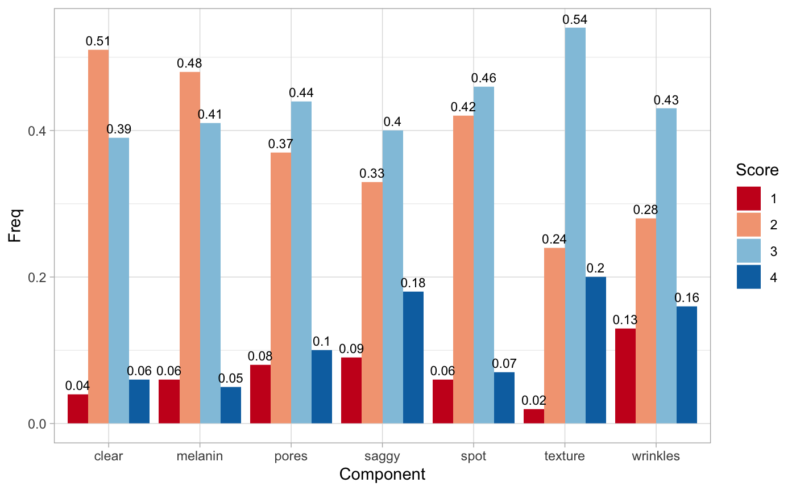

# aims

## 1. クロッピング関連＆前処理関連

* src/Preprocessing/**crop.py**: クロッピング用スクリプト

**Usage**
```
python crop.py -i (input_dir_path) -o (output_dir_path)
```
1. `input_dir_path`: マイクロスコープで撮影した画像が入ったディレクトリー
2. `output_dir_path`: クロップした画像を書き出すためのディレクトリー

* src/Preprocessing/**Image_Gamma_Correction.ipynb**: 画像の照度を統一するスクリプト
## 2. データ関連
### 皮膚癌API

* src/ISIC/**ISIC_makecsv.py**: ISICデータベースから画像idと皮膚癌の種類を取得するスクリプト（APIが遅いため、使っていない）

* src/ISIC/**ISIC_dl_image.py**: ISICデータベースから画像をダウンロードするスクリプト（APIが遅いため、使っていない）

* src/ISIC/**api.py**: ISICからデータベースを呼び出すためのスクリプト

### 皮膚癌データセット
* **class_label.csv**: 皮膚癌が７つのクラスに分類されたラベル(0~6)

## 3. ディープラーニング関連
### Exploratory Data Analysis
**項目ごとの肌スコアの分布**


**Model Baseline**: MAE < 4.797

平均値を使った場合、Mean Absolute Error(MAE)は4.797であった。よって、Deep Learningモデルはこれを下回る事を最低条件とする。

### Keras Models
* src/DeepEngine/**shallow_model.py**: 浅いkerasの肌評価モデル

* src/DeepEngine/**image_sorting.py**: ぼやけている画像を除去するスクリプト（shallow_model.pyで使っている）

* **multi_label.csv**: 皮膚科先生の評価のみ入ったラベル（shallow_model.pyで使っている）

### Densenet169 モデル
* src/DenseNet/**class_label1.csv**: ISICデータのラベル

* src/DenseNet/**DenseNet169_v3.ipynb**: DenseNet169（imagenet）のモデル

* evaluate_skin.ipynb*: 肌評価スクリプト
モデルはこのリンクからダウンロード
https://drive.google.com/drive/folders/1fQ-TpaNnC_d2FKFCPOXx97xQpDEtopuB?usp=sharing

## 4. node js関連
変数は以下の通り
scores = {"KIME":"","KEANA":"","SHIMI":"","TARUMI":"","TOUMEI":"","MERANIN":"","KOJIWA":""};
* src/node/**score.js**: python肌評価の結果をスコアに保存するスクリプト（結果はconsoleに表示）
* src/node/**ev_skin.py**: node jsで実行するpythonスクリプト
* src/node/**2000.jpg**: テスト画像
使用するモデルは上記のgoogledriveよりダウンロードしてください
